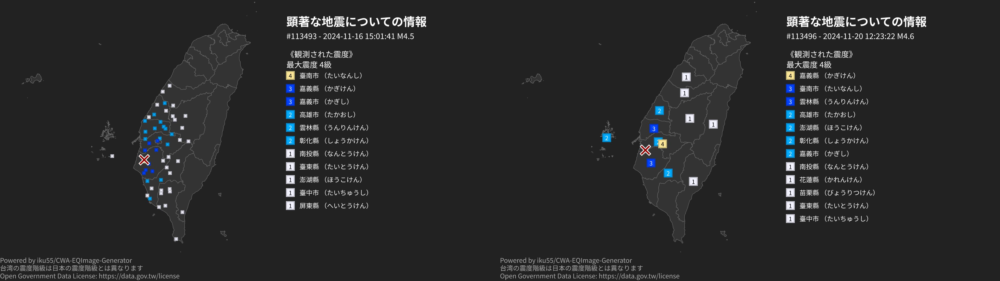

# CWA-EQImage-Generator

CWA-EQImage-Generatorは、台湾の中央気象局の地震情報を取得し、画像生成するコマンドラインツールです。

## 使用方法
`node geneqimage.mjs --apikey [APIキー]`を実行すると、out/\[地震番号].pngが生成されます。  
その他オプション:
- --apikey \[APIキー] APIキーを設定する
- --preferences \[パス] preferencesファイルを設定する
- --number \[地震番号] 生成する地震番号を設定する

後述のpreferencesファイルによって、生成内容はカスタマイズ可能です。

## preferencesの内容
| フィールド | 型 | 説明 |
| - | - | - |
| version | String | 固定値("1.0.0") |
| notes | Object | 補足情報の設定 |
| notes.color | [CSS Color](https://developer.mozilla.org/ja/docs/Web/CSS/color) (String) | 補足情報テキストの色 |
| notes.text | String[] (length=3) | 補足情報テキスト |
| points | Object | 観測点表示の設定 |
| points.type | "AREA", "POINTS" | 地域または観測点表示 |
| points.fillColors.`7級` `6強` `6弱` `5強` `5弱` `4級` `3級` `2級` `1級` | [CSS Color](https://developer.mozilla.org/ja/docs/Web/CSS/color) (String) | 観測点の塗りつぶし色 |
| points.strokeColors.`7級` `6強` `6弱` `5強` `5弱` `4級` `3級` `2級` `1級` | [CSS Color](https://developer.mozilla.org/ja/docs/Web/CSS/color) (String) | 観測点の境界色 |
| points.foreColors.`7級` `6強` `6弱` `5強` `5弱` `4級` `3級` `2級` `1級` | [CSS Color](https://developer.mozilla.org/ja/docs/Web/CSS/color) (String) | 観測点のテキスト色 |
| points.texts.`7級` `6強` `6弱` `5強` `5弱` `4級` `3級` `2級` `1級` | [CSS Color](https://developer.mozilla.org/ja/docs/Web/CSS/color) (String) | 観測点のテキスト |
| map | Object | 地図の設定 |
| map.topojsonData | Path (String) | 地図データ(topojson)へのパス |
| map.centroidsData | Path (String) | セントロイド(geojson)へのパス (NaturalEarthのデータを利用する場合、プロパティ`name_zsh`を`COUNTYNAME`に変更してください) |
| map.fillColor | [CSS Color](https://developer.mozilla.org/ja/docs/Web/CSS/color) (String) | 地図の塗りつぶし色 |
| map.strokeColor | [CSS Color](https://developer.mozilla.org/ja/docs/Web/CSS/color) (String) | 地図の境界色 |
| map.backgroundColor | [CSS Color](https://developer.mozilla.org/ja/docs/Web/CSS/color) (String) | 背景色 |
| image | Object | 画像の設定 |
| image.width | Number | 画像サイズ(横幅) 縦横比は16:9のみです |
| title | String | タイトル |
| color | String | タイトルなどのテキストの色 |
| font | [CSS Font Family](https://developer.mozilla.org/ja/docs/Web/CSS/font-family) (String) | フォント |
| fontFiles | String[] (Path[]) | 読み込むフォントファイル |
| fetch | Object | API取得の設定 |
| fetch.API_KEY | String? | CWAのAPIキー(必須ではない。--apikeyオプションを優先します。) |
| fetch.request_uri | String | APIのURL |
| output | Object | 出力先の設定 |
| output.file | Path (String) | 出力先ファイル("%"を地震番号で置き換えます。) |

## ライセンス
MITライセンスです。  
  
このソフトウェアには以下のデータが付属しています。  
  
**taiwan.topojson**  
https://data.gov.tw/dataset/7442 をTopoJSON形式に変換。データは最新でない場合があります。  
ライセンスは、[Open Government Data License, version 1.0](https://data.gov.tw/license)。  
  
**taiwan_centroids.json**  
https://data.gov.tw/dataset/7442 をQGISで重心を求めた。データは最新でない場合があります。  
ライセンスは、[Open Government Data License, version 1.0](https://data.gov.tw/license)。  
  
**NotoSansJP-Bold.ttf**, **NotoSansJP-Regular.ttf**  
https://fonts.google.com/noto/specimen/Noto+Sans+JP からダウンロード。  
ライセンスは、[Open Font License](https://fonts.google.com/noto/specimen/Noto+Sans+JP/license)。  
  
**その他**  
このソフトウェアは台湾のCWA(中央氣象署)のオープンデータAPIから情報を取得します。利用には、登録が必要です。  
ライセンスは、[Open Government Data License, version 1.0](https://data.gov.tw/license)。  